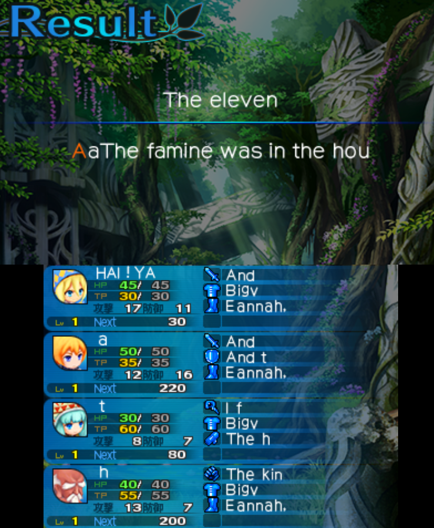

# EtrianMysteryDungeon2Translation
A tool to translate Etrian Mystery Dungeon 2.

## Guide to use
Extract the romfs folder of the "Releases" GitHub section in a modded 3DS or an emulator with mod support.

## Instructions
* Install Python 3.12.
* Install pythonnet "https://github.com/pythonnet/pythonnet"
* Run main.py or translate.py.

## Guide to make a mod
* You need a legal copy of Etrian Mystery Dungeon 2.
* Dump the RomFS.
* Use main.py to max export the folder of "message".
* Edit the csv files with a compatible editor.
* Put a copy of the original .bin files in a folder with the edited .csv.
* Use main.py to max import the csv files to the .bin.
* Load the mod with a modded 3DS or an emulator with the path "romfs/message/*.bin".

### Optional (Using a translation model)
+ Add a folder "Translations/CSV/Original" and add your csv files.
+ Add a folder "Translations/CSV/Changed".
+ Use translate.py to translate the csv files with a translation model.
+ Import your translated csv files from the "Changed" folder.

## Credits
Based in the work from Evan Dixon (https://github.com/evandixon/SkyEditor.ROMEditor).

The python file uses the dll from the "SkyEditor" from Evan Dixon.

The goal of the project was to add more option of exporting and importing the data of the .bin files of the original SkyEditor.

Special thanks to psy_commando for the documentation.